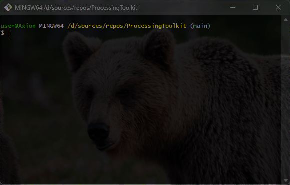

# 🔡 ProcessingToolkit
performs several operations on text and arrays

    

## 💻 About Program
*The program performs several operations on strings and arrays.*

### 🧩 Program sections
- ✅ *Sum of array elements*
- ✅ *The largest and smallest value*
- ✅ *Even and odd numbers*
- ✅ *Average value*
- ✅ *Reverse string array*
- ✅ *Number of vowels and consonants*
- ✅ *Checking if it is a palindrome*
- ✅ *Concatenated string array*
- ✅ *Removing characters from a string*
- ✅ *Appending a String with a Character*

### ⚙️ Technologies
 

## 🪟 Preview

## 🧑‍💻 I worked on it
- *Console class (I/O)*
- *Data types: string, char, int*
- *The selection operators: switch, if else statements*
- *Collections: Arrays*
- *Looping: for, foreach statements*
- *Methods of writing methods*
- *Random class*
- *Classes that perform conversion: Convert class*
- *Ternary operator*
- *StringBuilder class and of methods*

### 🤝 Future development
- *Optimizing methods for only a few arguments*